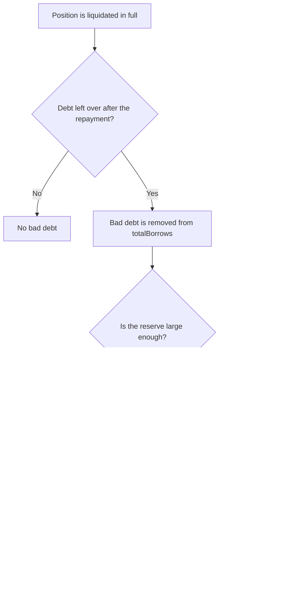

## What bad debt is

A loan is supposed to be liquidated while the collateral is still worth more than the debt. If the price falls too far and too fast, the collateral can end up worth less than what is owed. Even after a liquidator takes the entire position, part of the debt is left with nothing behind it. That leftover is **bad debt**.

Think of a pawn shop that lent $100 against a watch. The watch turns out to fetch only $80. The shop first covers the missing $20 from its own rainy day fund. Only if that fund runs out do the people who financed the shop take a loss.

On Farmenta the rainy day fund is the market's reserve, and the people who financed the loans are the lenders of that market.

## Four layers of defence

| Layer | What it does |
|---|---|
| 1. Prevention | Conservative max LTV and liquidation threshold, debt caps per pool and per market, a minimum position value, and a curated list of pools |
| 2. Reserve | Bad debt is taken from the market's reserve first. All of it is available, including the part under the reserve floor. |
| 3. Socialization | What the reserve cannot cover is socialized to lenders of the same market through a lower share price |
| 4. Isolation | The Blue-chip and Meme markets are separate. Bad debt in one never touches lenders of the other. |



## When bad debt is recorded

Bad debt only appears in one place: a liquidation that takes the whole position.

During a liquidation, the liquidator repays debt and receives collateral worth the repaid amount plus a bonus. If that would be more than everything the position contains, the contract cuts the repayment down:

```text
repay = realizableValue / (1 + bonus)
```

The liquidator then receives the entire position, the loan record is deleted, and whatever debt remains is bad debt:

```text
badDebt = debt − repay
```

Two things follow from this rule:

- A liquidator never pays more than the position can hand over.
- The amount of bad debt does not depend on the `repayAmount` the liquidator typed in.

The borrower loses the whole position. The remaining debt is not pursued: it becomes the protocol's loss.

`realizableValue` is what the position really contains: principal plus all unclaimed fees, after the removal haircut. It is not the lens view `positionValue`, which caps fees at 10% of principal. See [liquidation mechanics](../liquidations/mechanics.md).

## A worked example

This continues the Blue-chip example used across these pages. Lina is the only lender, with lender funds of $101,062.50 after a year of interest. The market holds $50,000 in cash, borrowers owe $51,250 in total, and the reserve holds $187.50. Budi owes 12,300 USDG.

The price of ETH falls by more than half overnight. Budi's position is now worth $11,000.

```text
HF = $11,000 × 75% / $12,300 = 0.671
```

`HF` is below 0.9, so the whole debt may be closed in one liquidation. Closing all of it would mean seizing $12,300 × 1.05 = $12,915, which is more than the $11,000 the position holds. The full seizure rule applies.

Rina liquidates:

```text
repay after the cut     = $11,000 / 1.05              = $10,476.19
protocol fee (0.5%)     = $10,476.19 × 0.5%           =     $52.38    to the reserve
Rina pays               = $10,476.19 + $52.38         = $10,528.57
Rina receives the whole position                      = $11,000.00
Rina's margin                                         =    $471.43

bad debt                = $12,300 − $10,476.19        =  $1,823.81
```

### Layer 2: the reserve absorbs first

```text
reserve = $187.50 + $52.38                            =    $239.88
absorbed by the reserve                               =    $239.88
reserve afterwards                                    =      $0.00
```

The liquidation fee from this very liquidation is added to the reserve before the bad debt is taken out. The reserve floor at that moment is $1,010.62, far above the $239.88 in the reserve. The floor plays no role: the entire reserve is used.

### Layer 3: the rest is socialized to lenders

```text
socialized = $1,823.81 − $239.88                      =  $1,583.93
```

| | Before | After |
|---|---|---|
| Cash | $50,000.00 | $60,528.57 |
| Total borrows | $51,250.00 | $38,950.00 |
| Reserve | $187.50 | $0.00 |
| **Lender funds (`totalAssets`)** | **$101,062.50** | **$99,478.57** |

Lender funds fall by exactly $1,583.93, the socialized amount. Lina's number of shares is unchanged, but each share is now redeemable for less USDG. After earning $1,062.50 in interest, she is $521.43 below the $100,000 she started with.

## How the accounting works

```text
totalAssets = cash + totalBorrows − reserves
```

1. The whole loan leaves `totalBorrows`: the repaid part and the bad debt. That debt no longer exists.
2. The liquidator's payment arrives as cash: the repayment and the protocol fee.
3. The reserve is credited with the protocol fee, then reduced by `min(reserves, badDebt)`.

The part covered by the reserve changes nothing for lenders: `totalBorrows` and `reserves` fall by the same amount, so `totalAssets` stays put.

The part the reserve cannot cover has nothing to fall against. It lowers `totalAssets` directly, and with it the share price of `fUSDG-BC` or `fUSDG-MEME`.

The market emits two events in that liquidation:

| Event | Content |
|---|---|
| `Liquidate` | Includes `badDebt`, the full amount of debt the position could not cover ($1,823.81 in the example), and `fullSeizure = true` |
| `BadDebtSocialized` | Only the part that reached lenders ($1,583.93 in the example). Not emitted if the reserve covered everything. |

## The reserve floor does not get in the way

The reserve floor limits what the **owner** can withdraw from the reserve. It does not limit loss absorption. Bad debt can take the reserve all the way to zero.

After such an event the reserve is below its floor, so owner withdrawals are closed automatically until interest and liquidation fees have refilled it. See [protocol fees and reserves](./protocol-fees-and-reserves.md).

## Isolation between markets

The Blue-chip market and the Meme market are two separate contracts with separate cash, separate reserves and separate share tokens. A loss in the Meme market lowers the share price of `fUSDG-MEME` only. Holders of `fUSDG-BC` are not affected, and the other way round.

The price of isolation is that liquidity is split between two markets.

## What lenders should take from this

:::warning[Lenders can lose part of their deposit]
If a loan ends as bad debt and the reserve is too small to cover it, the remainder is socialized to every lender of that market through a lower share price. Nothing else stands between a loss and lenders.

The reserve grows only from interest and liquidation fees, so it is small compared with the loans it stands behind. In the example above it covered about 13% of a single loss.

Losses are shared in proportion to shares held at the moment the bad debt is recorded.
:::

Bad debt becomes more likely when:

- prices fall faster than liquidators act,
- liquidation is unavailable for a while, for example during a pause or while a price feed is stale,
- a meme token collapses or its pool loses liquidity,
- a debt cap is large compared with the depth of the pool.

These risks are described in [oracle and market risks](../risk/oracle-and-market-risks.md) and the [risk overview](../risk/overview.md).

## Related pages

- [Protocol fees and reserves](./protocol-fees-and-reserves.md)
- [Health factor, LTV and liquidation threshold](./health-factor.md)
- [Liquidation mechanics](../liquidations/mechanics.md)
- [Worked example: bad debt scenario](../worked-example/bad-debt-scenario.md)
- [Markets](../overview/markets.md)
- [Events reference](../reference/events.md)
