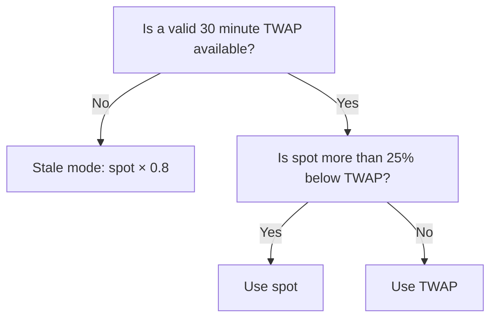

## Two questions, two levels of strictness

Farmenta asks a price two different questions:

1. **May this person take value out?** (borrow, claim fees, remove liquidity)
2. **May this loan be liquidated?**

The first question is answered strictly. If anything about the price looks off, the action is refused. The second question is never blocked by a price gate, because a loan that cannot be liquidated turns into bad debt. It still stops during a pause and while a Chainlink price is stale.

It works like a bank teller who refuses to hand out new loans while the rate screen flickers, but whose collections desk stays open through the same flicker.

## A small example

Chainlink reports ETH at $2,500. A large swap has pushed one ETH/USDG pool to $2,440.

```text
deviation = |$2,440 − $2,500| / $2,500 = 2.4%
```

2.4% is more than the 2% limit, so borrowing against positions in that pool is blocked until the pool moves back. A position in that pool with `HF < 1` can still be liquidated, and it is valued at the Chainlink price of $2,500.

## Price sources

| Token | Source | Rules |
|---|---|---|
| ETH and WETH | Chainlink ETH/USD | Staleness limit 25 hours. The answer must be greater than zero. |
| USDG | Chainlink USDG/USD | Staleness limit 25 hours. Bounds 0.97 to 1.03: outside them borrowing is blocked. The USDG value is always used as reported, never forced to 1.00. |
| Meme tokens | On-chain `TwapRecorder`: 30 minute TWAP of the pool, priced in USDG, multiplied by the USDG price | See the Meme market rules below. |

A TWAP (time weighted average price) is the average price of a pool over a window of time. It is much harder to move than the price at a single moment.

The feed address of each token is stored in the token configuration when the token is listed. Feed addresses are on the [addresses page](../reference/addresses.md). Chainlink documentation is at [docs.chain.link](https://docs.chain.link/data-feeds).

All prices are USD per one whole token with 18 decimals.

:::warning[A stale Chainlink price stops more than borrowing]
If a Chainlink answer is older than 25 hours, zero or negative, the price call reverts (`StalePrice` or `InvalidPrice`). Every action that needs that price then reverts, liquidation included. Repaying, withdrawing collateral with no debt, and lender withdrawals do not read a price and keep working. See [oracle and market risks](../risk/oracle-and-market-risks.md).
:::

## Rules on the Blue-chip market

| Action | Price used | Gate |
|---|---|---|
| Borrow | Chainlink | Pool spot price must be within 2% of the Chainlink derived price, and USDG must be inside 0.97 to 1.03 |
| Liquidate | Chainlink | None. Liquidation runs even if the pool lags the oracle or USDG is outside its bounds. |

The spot deviation is measured on price, as described in [how positions are valued](./position-valuation.md). A borrow that fails the gate reverts with `SpotPriceDeviation` or `UsdgPriceOutOfBounds`.

## Rules on the Meme market

Meme tokens have no Chainlink feed. Their price comes from the pool itself, so the rules lean on the difference between the spot price and the 30 minute TWAP.

| Action | Price used for the meme token |
|---|---|
| Borrow | `min(spot, TWAP)`: the lower of the two |
| Liquidate, normal case | TWAP |
| Liquidate, crash | Spot, when spot is more than 25% below TWAP |
| Liquidate, stale mode | Spot × 0.8 |

The USDG bounds of 0.97 to 1.03 also apply to borrowing on the Meme market. The 2% spot deviation gate does not: `min(spot, TWAP)` takes its place.

**Why `min(spot, TWAP)` for borrowing.** Pumping the spot price for a moment does not raise a borrowing limit, because the lower TWAP is used. To borrow against a higher price, the spot price and the 30 minute average both have to be high at the same time.

**Why a crash threshold for liquidation.** The TWAP lags. In a real crash the average is still high while the token is already worth much less. Once spot is more than 25% below TWAP, liquidation switches to spot so that positions can be cleared at a realistic price.



### Example

The TWAP of a meme token is $0.0100.

| Spot price | Borrow values the token at | Liquidation values the token at |
|---|---|---|
| $0.0120 | $0.0100 (TWAP is lower) | $0.0100 (TWAP) |
| $0.0090 | $0.0090 (spot is lower) | $0.0100 (TWAP, spot is only 10% below) |
| $0.0070 | $0.0070 | $0.0070 (spot, 30% below TWAP) |

The crash threshold sits at `TWAP × 0.75`, which is $0.0075 here.

## The TWAP recorder

`TwapRecorder` is a permissionless contract that stores price observations for a pool.

- Anyone can call `record(poolKey)` or `recordBatch(poolKeys)`. Each call saves the pool's current tick and timestamp. At most one observation is stored per timestamp.
- It keeps up to 2,048 observations per pool.
- `consult` returns the geometric average tick over the last 1,800 seconds (30 minutes).
- Deposits of collateral, `borrow`, `collectFees`, `increaseLiquidity` and `decreaseLiquidity` on a Meme pool record an observation first. `liquidate` records its observation at the end, so the liquidation is priced on the recorder exactly as it found it. `repay`, `withdrawCollateral` and the vault functions do not record.
- The team plans to run a keeper that records observations on a schedule for pools with active debt. It is not running yet.

### Stale mode

The TWAP is only valid when both of these hold:

- the oldest stored observation is at least 1,800 seconds old, and
- the latest observation is no older than 900 seconds.

Otherwise the TWAP is unavailable. This is stale mode:

| Price asked for | Behaviour in stale mode |
|---|---|
| Borrowing price (borrow, the gated actions below, and the lens views `healthFactor`, `maxBorrow` and `positionValue`) | Reverts with `MemeTwapUnavailable`. The lens views revert. Market actions record a fresh observation first, so they are refused only while the pool has less than 30 minutes of recorded history |
| Liquidation price (`liquidate` and the lens view `liquidationHealthFactor`) | Spot × 0.8 |

Anyone can end stale mode by calling `record`, including the borrower. As long as the recorder still holds an observation that is at least 30 minutes old, one new observation makes the TWAP valid again.

Two consequences follow from the recording order:

- A market transaction such as `borrow` records an observation before it prices the position. It therefore refreshes a recorder whose latest observation had aged past 900 seconds. It is still refused while the pool has less than 30 minutes of recorded history, which is why a newly listed Meme pool needs 30 minutes of history before the first borrow.
- `liquidate` records last, so it is the path that actually prices at spot × 0.8 when the recorder has gone quiet.

## The same gate protects fee claims and liquidity changes

Taking fees or liquidity out of a position lowers its value exactly like borrowing does. So while a position has debt, these actions pass the same price gate as `borrow`:

- `collectFees`
- `increaseLiquidity` (it claims the position's fees first)
- `decreaseLiquidity`

On Blue-chip that means USDG inside its bounds and the pool within 2% of Chainlink. On Meme it means USDG inside its bounds and an available TWAP, with the meme token valued at `min(spot, TWAP)`.

A position with no debt skips the gate. `decreaseLiquidity` still needs a working price in that case, because the minimum position value of what remains is measured in USD. Details are in [managing a position while it is collateral](./managing-collateral.md).

## Debt is priced too

Your debt is in USDG. Before it is compared with a collateral value in USD, it is converted with the USDG oracle price, not at an assumed $1.00.

```text
debtUsd = debt × price(USDG) / 10^6
```

The USDG inside your position is valued with the same price, so both sides of the [health factor](./health-factor.md) move together if USDG drifts.

## No sequencer uptime feed

Robinhood Chain has no Chainlink sequencer uptime feed, so the contracts cannot detect on their own that the sequencer is down or has just restarted. The mitigation is manual: the owner pauses the market.

:::warning[Pausing also stops liquidation]
A pause stops borrowing and every other action that relies on a price, and it also stops `liquidate`. If prices keep falling during a pause, positions can end up as bad debt. See [pause and emergency](../risk/pause-and-emergency.md).
:::

## Known limits

Price manipulation risks, including the ones that only affect the Meme market, are described in [oracle and market risks](../risk/oracle-and-market-risks.md).

## Related pages

- [How positions are valued](./position-valuation.md)
- [Health factor, LTV and liquidation threshold](./health-factor.md)
- [PriceOracle reference](../reference/price-oracle.md)
- [TwapRecorder reference](../reference/twap-recorder.md)
- [Liquidation overview](../liquidations/overview.md)
