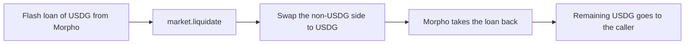

## What a liquidator does

A liquidator watches loans and, when one becomes unhealthy, repays part of it in USDG in exchange for tokens worth more than the amount repaid. It is open to anyone, and nobody has priority.

In the example from the [liquidations overview](./overview.md), Rina repays 6,150 USDG on a Blue-chip loan, pays a 30.75 USDG protocol fee, and receives $6,457.50 of ETH and USDG. Her margin before gas and swap costs is $276.75, which is 4.5% of the amount repaid.

This page is the practical companion to [liquidation mechanics](./mechanics.md). Read that page first if you are writing a bot.

:::warning[Liquidation is competitive and risky]
Other liquidators race for the same loans, prices move between your simulation and your transaction, and a failed transaction still costs gas. Losses caused by your own inputs are yours: tokens sent to a wrong `to` address, a swap route that leaves tokens behind in the router, or a swap with a weak minimum output. The protocol does not refund them.
:::

## Find candidates

The market keeps no list of loans on-chain, and the Uniswap PositionManager cannot enumerate positions either. The list of loans exists only in the [indexer](../reference/indexer.md), which rebuilds it from events.

- `/loans?status=in_custody` returns every position a market currently holds.
- `/loans/keeper-candidates` returns the loans on Meme pools that are in custody and have borrowed at least once.

The indexer does not know the debt or the health factor of a loan. Interest accrues without an event, and prices move without an event. A loan flagged as having borrowed may have been repaid since. Confirm every candidate on-chain.

## Decide when to liquidate

Read two views from the `MarketLens` of the market. Each market has its own lens.

```solidity
function liquidationHealthFactor(uint256 tokenId) external view returns (uint256);
function liquidationCloseFactorBps(uint256 tokenId) external view returns (uint16);
```

- `liquidationHealthFactor` is scaled by `1e18`. A loan is liquidatable when the result is below `1e18`. A position with no debt returns the maximum `uint256`.
- `liquidationCloseFactorBps` returns `5000` or `10000`, the close factor the market will apply at the current block.

Both views project interest up to the current block and use the same price path as the liquidation check, so they agree with what `liquidate` will decide in the same block.

**Do not decide from `healthFactor`.** That view is for display and borrowing. It uses the borrow price path and the debt as of the market's last accrual. On the Meme market the two price paths are different, so `healthFactor` can show a loan as healthy when it can be liquidated, or the reverse. It also reverts while a meme pool's TWAP is unavailable.

**Simulate before you send.** Call `liquidate` with `eth_call` from the address that will send the transaction. The simulation runs the full logic and returns `repaid`, `out0`, `out1` and `badDebt`. It is the only check that catches every revert, including `FeePurchaseUnderfunded`. The simulated caller needs the same USDG balance and allowance as the real one. If you use the helper, simulate `execute` on the helper instead.

## Choose repayAmount

`repayAmount` is a budget, not an exact amount. The market computes:

```text
repay  = min(repayAmount, debt × closeFactor)
pulled = repay + protocol fee + cost of a bought fee leg
```

When you call the market directly:

- You need the USDG in your wallet and an allowance to the market that covers what is pulled.
- You can pass `type(uint256).max`. The market then repays as much as the close factor allows and funds any fee leg purchase, and it only pulls what it uses.
- If you pass a real number, make it larger than `debt × closeFactor`. On a position whose unclaimed fees are worth more than the seizure, a `repayAmount` exactly equal to the close factor amount reverts. See [consequences for callers](./mechanics.md#consequences-for-callers).
- At a 100% close factor, add a cushion above the debt you read. Debt grows every second, so the debt at execution is slightly higher than the debt in your last read.

## Set minOut0 and minOut1

`minOut0` and `minOut1` are raw token amounts of `currency0` and `currency1`. They are checked against everything you receive, including a fee leg you bought.

The size of the slice is computed from oracle prices, but the tokens come out of the pool at the pool's own price. If the pool price moves before your transaction executes, you receive a different mix of the two tokens. Take the amounts from your simulation, subtract a tolerance you are comfortable with, and pass the result.

## Choose the recipient

`to` must be an address you control that can receive both tokens, including native ETH on pools that use it. The market rejects the zero address, the market itself, `address(1)`, `address(2)` and the Uniswap PositionManager with `InvalidRecipient`. Every other address is accepted as given.

## Use LiquidatorHelper

`LiquidatorHelper` lets you liquidate without your own capital. It combines a flash loan, the liquidation and the swap in one transaction. A helper is bound to one market.

```solidity
function execute(uint256 tokenId, uint256 repayAmount, bytes calldata swapCalldata) external;
```



1. The helper borrows `repayAmount × (1 + protocol fee rate)` USDG from Morpho as a flash loan.
2. It calls `liquidate(tokenId, repayAmount, 0, 0, helper)`.
3. It pushes its whole balance of the non-USDG token to the Uniswap UniversalRouter (native ETH as call value, ERC-20 tokens by transfer) and calls the router with your `swapCalldata`.
4. It checks that the helper holds no ETH and none of the pool's non-USDG token (for a pool that uses native ETH, the token checked is WETH). Otherwise it reverts with `ResidualBalance`.
5. Morpho takes the flash loan back. If the helper does not hold enough USDG, the whole transaction reverts.
6. The USDG that remains is sent to the caller of `execute`.

### repayAmount in the helper

The helper borrows the whole budget from Morpho, so the `type(uint256).max` idiom does not apply. Pass a real number:

- Start from `debt × closeFactor` and add a margin for a possible fee leg purchase.
- At a 100% close factor, add a cushion for interest. The cushion is borrowed too. Morpho charges no fee for flash loans, and the amount is limited by the USDG that Morpho holds.
- Zero reverts with `ZeroRepayAmount`.

The helper does not filter out calls that the market will reject. A revert is atomic and costs only gas, but catching it is the job of your simulation.

### Building the swap calldata

The helper passes zero for `minOut0` and `minOut1`. **The minimum output in your swap calldata is the only price protection.**

The exact seized amount cannot be known off-chain to the wei. It depends on the debt at execution, the oracle price, and the pool price, and all three can change between your quote and your transaction. A route that names an exact input amount will therefore leave tokens behind or fail. Build the route so that it contains no input amount:

```text
SETTLE(currency, CONTRACT_BALANCE, false)     pay the router's whole balance into the pool manager
SWAP_EXACT_IN_SINGLE(amountIn = OPEN_DELTA)   swap exactly what was settled
TAKE_ALL(USDG, minOut)                        take the USDG, revert below minOut
```

Keep these points in mind:

- **Consume the whole input.** Anything the route does not consume stays in the UniversalRouter, where anyone can sweep it. Add an explicit sweep if your route can leave a remainder.
- **The swap covers a bought fee leg too.** The helper pushes everything it holds of the non-USDG token, whether it was seized or bought.
- **Native ETH is not wrapped by the helper.** It reaches the router as ETH. If your route needs WETH, wrap it inside the router.
- **Use the current parameter layout.** The `ExactInputSingleParams` struct of the deployed UniversalRouter includes the field `minHopPriceX36`. Calldata encoded with the older five-field struct is decoded incorrectly and does not always revert.
- **After a full seizure, route through another pool.** The seized position may have been the entire active liquidity of its pool. A swap into that same pool then trades nothing and fails.

Third party contract addresses are listed in [addresses](../reference/addresses.md). The helper's functions and errors are in the [LiquidatorHelper reference](../reference/liquidator-helper.md).

## Meme market notes

On the Meme market the price of the meme token comes from the on-chain [TwapRecorder](../reference/twap-recorder.md), not from Chainlink. The liquidation check uses one of three prices:

| Situation | Price used for the meme token |
|---|---|
| Normal | The 30 minute TWAP |
| Crash: the pool spot price is more than 25% below the TWAP | The pool spot price |
| Stale mode: the TWAP is unavailable | The pool spot price minus 20% |

The TWAP is unavailable when the newest observation is older than 900 seconds, or when the recorded history does not reach back 30 minutes.

- **Anyone can record.** `record(PoolKey)` and `recordBatch(PoolKey[])` on the TwapRecorder are permissionless. One call is enough to end stale mode on a pool with enough history.
- **A stale mode liquidation can disappear.** If a loan is liquidatable only because of the 20% stale haircut, the borrower or anyone else can call `record` before your transaction lands. Your call then reverts with `PositionIsHealthy`.
- **`liquidate` does not record before the check.** It records an observation after the seizure. The check reads the recorder as it finds it, which is the same state `liquidationHealthFactor` reads.
- **The close factor is always 100%.** Add a cushion to `repayAmount`, as described above.
- **The bonus is at least 10%** and the protocol fee is one tenth of it.

USDG is priced by Chainlink on both markets.

## Common reverts

| Error | What to check |
|---|---|
| `PositionIsHealthy` | The loan recovered, someone else liquidated it, or a TWAP observation was recorded |
| `FeePurchaseUnderfunded` | `repayAmount` leaves no budget above `debt × closeFactor` |
| `SeizureBelowMinimum` | The pool price moved, or `minOut0` and `minOut1` are too tight |
| `InvalidRecipient` | `to` is a refused address |
| `NothingToRepay` | `repayAmount` is zero or rounds to a zero repayment |
| `SwapFailed` (helper) | The router call failed, often because of `minOut` |
| `ResidualBalance` (helper) | The route sent non-USDG tokens back to the helper |

`liquidate` also reverts while the market is paused, and when a Chainlink feed it needs is stale or returns an invalid price.

## Checklist

1. Get candidates from the indexer's loan list.
2. Read `liquidationHealthFactor` and `liquidationCloseFactorBps` from the MarketLens. Ignore `healthFactor`.
3. Choose `repayAmount` above the close factor amount. Add a cushion at a 100% close factor.
4. Simulate `liquidate` with `eth_call` and read `repaid`, `out0`, `out1` and `badDebt`.
5. Set `minOut0` and `minOut1` from the simulation, or set the minimum output of the swap when you use the helper.
6. Check that `to` is an address you control and that it can receive native ETH.
7. With the helper: build the route without an input amount, consume the whole balance, and avoid the seized pool after a full seizure.
8. Compare the expected margin (nine tenths of the bonus) with gas, swap fees and slippage.
9. Send the transaction and expect to lose some races.

## Related pages

- [Liquidations overview](./overview.md)
- [Liquidation mechanics](./mechanics.md)
- [MarketLens reference](../reference/market-lens.md)
- [LiquidatorHelper reference](../reference/liquidator-helper.md)
- [Indexer](../reference/indexer.md)
- [Oracle and market risks](../risk/oracle-and-market-risks.md)
