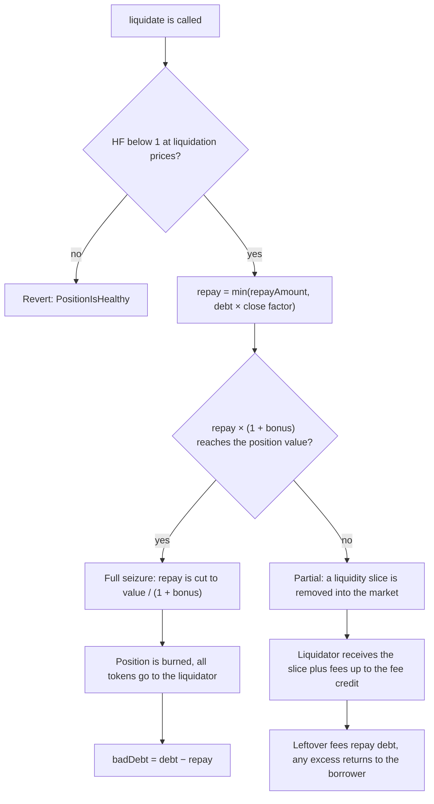

## What happens in a liquidation

A liquidator repays part of an unhealthy loan in USDG and receives tokens from the borrower's liquidity position, worth the amount repaid plus a bonus. The contract decides how much may be repaid, how much may be seized, and whether the position survives.

In the example from the [liquidations overview](./overview.md), Rina repays 6,150 USDG, pays a 30.75 USDG protocol fee, and receives $6,457.50 of ETH and USDG. This page explains every rule behind those numbers. It is written for liquidators and developers.

## The function

```solidity
function liquidate(
    uint256 tokenId,
    uint256 repayAmount,
    uint128 minOut0,
    uint128 minOut1,
    address to
) external returns (uint256 repaid, uint256 out0, uint256 out1, uint256 badDebt);
```

| Argument | Meaning |
|---|---|
| `tokenId` | The Uniswap v4 position NFT the market holds as collateral. If the market has no loan record for it, the call reverts with `PositionNotCollateral` |
| `repayAmount` | The USDG budget the caller offers, 6 decimals. It is an upper limit, not an exact amount. The contract cuts it down by the close factor and by what the position can pay for |
| `minOut0` | The least `currency0` the caller accepts, measured on what the caller receives |
| `minOut1` | The least `currency1` the caller accepts, on the same basis |
| `to` | The address that receives the seized tokens. Some addresses are refused, see [recipient rules](#recipient-rules) |

| Return value | Meaning |
|---|---|
| `repaid` | USDG taken off the debt, including any of the borrower's own fees applied to it |
| `out0`, `out1` | `currency0` and `currency1` the liquidator received, including a fee leg it bought |
| `badDebt` | Debt the position could not cover. Non-zero only on the full seizure branch |

The caller must hold the USDG and approve the market to spend it. The market pulls `repay + protocolFee + cost`, where `cost` is the price of a bought fee leg (explained below). Since `repay + cost` never exceeds `repayAmount`, the total pulled never exceeds `repayAmount × (1 + protocol fee rate)`.

## Step 1: the health check

The market first accrues interest, so the debt includes interest up to the current block. It then values the position and the debt through the liquidation price path of the oracle, `priceForLiquidation`. The borrow price path and its gates are never read, which is why a pool or a USDG price that blocks borrowing does not block liquidation.

One reading of the position produces two different values:

```text
collateralValue = (principalUsd + min(feesUsd, principalUsd / 10)) × (1 − removalHaircut)
value           = (principalUsd + feesUsd) × (1 − removalHaircut)

HF = collateralValue × LT / debtUsd
```

- The **health check** uses `collateralValue`, where unclaimed fees count only up to 10% of principal. Fee balances are easier to inflate than principal, so they are capped wherever the protocol decides how safe a loan is.
- The **seizure math** uses `value`, the realizable value: principal plus all fees. The liquidator receives real tokens, so the contract has to compare the seizure with what the position really holds. Using the capped number here would hand out more than `repay × (1 + bonus)` and would declare bad debt on positions that can still cover their debt.

If `HF >= 1` the call reverts with `PositionIsHealthy(tokenId, healthFactor)`.

## Step 2: the repay amount picks the branch

```text
repay      = min(repayAmount, debt × closeFactor)
seizeValue = repay × (1 + bonus)
```

The close factor is 100% on the Meme market. On the Blue-chip market it is 50%, or 100% if `HF < 0.9` or the debt is below 100 USDG. The 100 is an amount of USDG, not a dollar value.

If `seizeValue >= value`, the contract cuts `repay` down to `value / (1 + bonus)`, rounded down, and takes the whole position. This is the full seizure branch. The liquidator never pays for more than they can be handed, and the resulting bad debt does not depend on the `repayAmount` the caller typed.

Otherwise the position survives and the partial branch runs. A partial liquidation whose `repay` is zero reverts with `NothingToRepay`.



## Partial branch

### The slice

```text
feeValue    = value of unclaimed fees, after removal haircut
feeCredit   = min(feeValue, seizeValue)
liqToRemove = liq × (seizeValue − feeCredit) / (value − feeValue)
```

Fees are used first. `feeCredit` is the part of the seizure paid out of unclaimed fees, and only the rest is paid out of principal by removing `liqToRemove` from the position.

Removing liquidity from a Uniswap v4 position always realizes all of its unclaimed fees, however little liquidity is removed. If the proceeds went straight to the liquidator, a one wei repay would collect every fee in the position. The proceeds therefore go to the **market first**. The market then forwards the liquidator's share: the principal slice plus fees worth `feeCredit`, split pro rata between `currency0` and `currency1`.

### Leftover fees

Leftover fees (`feeValue − feeCredit`) exist only when the position holds more fees than the seizure is entitled to. They belong to the borrower and are used on the borrower's remaining debt:

1. **The USDG leg repays debt directly.** It is already in the market, so this is a ledger entry.
2. **The non-USDG leg must be bought by the liquidator** while debt remains. The core protocol never swaps, so the liquidator pays USDG for that leg at the liquidation price, with no bonus and no protocol fee. The USDG repays debt and the tokens are added to the liquidator's payout. The amount bought is limited by the remaining debt.
3. **Only the excess above the debt returns to the borrower.**

The purchase is paid from what `repayAmount` leaves after `repay`. If that is not enough, the call reverts with `FeePurchaseUnderfunded(required, available)`. It does not fall back to returning the leg to the borrower, because that would let a tiny repay move collateral out to a borrower who is still in debt and push the health factor down on demand.

The purchase is a sale, not a seizure. It counts toward neither the close factor nor the `repay × (1 + bonus)` ceiling.

### Returning the excess to the borrower

The borrower's payout is the one transfer a borrower could use to block their own liquidation, so it cannot revert:

- **Native ETH** is sent with a fixed gas stipend of 50,000. If the borrower refuses it, the ETH is wrapped and sent as WETH, which runs none of the borrower's code.
- **ERC-20 tokens** are sent with a non-reverting transfer. If the borrower cannot receive the token (USDG, for example, can freeze an address), the liquidation still succeeds. What cannot be delivered stays in the market and the borrower's claim to it is gone. Undelivered USDG becomes cash of the market and so benefits its lenders. Any other undelivered token has no way out of the contract.

### A position with more fees than the seizure

This position is unusual, with fees as large as its principal, and is chosen to show every rule at once. Blue-chip market, 5% bonus, USDG at $1.00, no removal haircut.

```text
principal  $5,000     fees  $5,000  ($2,000 in USDG, $3,000 in ETH)     debt  4,200 USDG

HF          = ($5,000 + $500) × 75% / $4,200     = 0.982    (close factor 50%)
repay       = 4,200 × 50%                        = 2,100 USDG
seizeValue  = 2,100 × 1.05                       = $2,205
feeCredit   = min($5,000, $2,205)                = $2,205
liqToRemove = liq × ($2,205 − $2,205) / $5,000   = 0

leftover fees = ($5,000 − $2,205) / $5,000       = 55.9% of each leg
    USDG leg   $2,000 × 55.9%                    = $1,118
    ETH leg    $3,000 × 55.9%                    = $1,677

debt after repay                                 = 2,100 USDG
USDG leg applied to debt                         = 1,118 USDG   (982 USDG of debt left)
ETH leg bought by the liquidator                 = $982 of ETH for 982 USDG
ETH returned to the borrower                     = $1,677 − $982 = $695
```

The liquidator pays `2,100 + 10.50 + 982 = 3,092.50` USDG and receives `$2,205 + $982 = $3,187`. The profit is $94.50, which is still 4.5% of `repay`. The call returns `repaid = 2,100 + 1,118 + 982 = 4,200`, so the debt is cleared. It only succeeds if `repayAmount` is at least 3,082 USDG.

## Full seizure branch

When the repay cap applies, the market burns the position and the Uniswap PositionManager pays both tokens, fees included, directly to `to`. Native ETH arrives as ETH.

```text
repay   = value / (1 + bonus), rounded down
badDebt = debt − repay
```

The loan record is deleted and `badDebt` is recorded in the same transaction. It is taken from the market's reserves first, all of them if needed, and the part reserves cannot cover is socialized to the lenders of that market and reported in `BadDebtSocialized`. The `Liquidate` event carries `fullSeizure = true` whenever the position was burned, with or without bad debt. See [bad debt](../concepts/bad-debt.md).

For example, a Blue-chip position worth $11,000 with a debt of 12,300 USDG has a health factor of 0.671, so the close factor is 100%. Repaying everything would seize `$12,300 × 1.05 = $12,915`, more than the position holds. The contract cuts `repay` to `$11,000 / 1.05 = 10,476.19` USDG, the liquidator pays that plus a 52.38 USDG fee and receives the whole position, and `badDebt` is `12,300 − 10,476.19 = 1,823.81` USDG.

## Protocol fee

```text
protocolFee = repay × (liquidatorBonusBps / 10) / 10,000
```

The rate is derived at liquidation time from the same pool terms that grant the bonus, so the two cannot drift apart. Both divisions round down, in the liquidator's favour. The fee is paid in USDG on top of `repay`, is charged on `repay` only (not on a bought fee leg), and is added to the market's reserves.

## Execution order

The steps above describe the logic. The order in which the contract executes them is different, and deliberate:

1. Accrue interest, check `to`, check that the loan exists.
2. Compute: value the position, check the health factor, work out the seizure.
3. Partial branch only: remove the slice, with the proceeds going to the market.
4. Pull the liquidator's USDG: `repay`, the protocol fee, and the cost of a bought fee leg.
5. Write the whole ledger: debt shares, pool debt, total borrows, reserves, and bad debt.
6. Pay out. On the partial branch the borrowed asset (USDG) leaves first, then the other token. On the full branch the position is burned and paid to `to`.
7. Check `minOut0` and `minOut1`.
8. On the Meme market, record a TWAP observation for the pool.

This ordering is what makes reentrancy from a payout callback harmless. The reentrancy guard covers the market's own functions, but the vault exits `withdraw` and `redeem` stay open, and a native ETH payout runs the recipient's code. If the ledger were still unwritten at that moment, `totalAssets` would count the liquidator's USDG as cash while the debt it repays, and any bad debt about to be written off, still sat in total borrows. A lender redeeming from inside the callback would be paid at that inflated share price at the expense of every other lender. Because the ledger is settled before anything leaves, no callback ever sees a state that is only half updated. On the partial branch USDG also leaves before any token that can trigger a callback. On the full branch PositionManager pays both tokens in pool order.

The TWAP observation is recorded last for a different reason. Recording before the health check would make a stale recorder fresh again on the spot, so the check would never see the state that a read-only call sees. The check and the seizure run on the recorder as they find it, and the liquidation leaves its observation behind afterwards.

## Recipient rules

`liquidate` reverts with `InvalidRecipient(to)` if `to` is one of:

| Refused address | Why |
|---|---|
| The zero address | The tokens would go nowhere |
| The market itself | The payout would sit in the market, where ERC-20 tokens have no way out |
| `address(1)` | The Uniswap PositionManager reads it as "the caller", which is the market again |
| `address(2)` | The PositionManager reads it as itself, and anyone can sweep its balance |
| The PositionManager | Same as `address(2)` |

The reasons in the table describe the full seizure branch, where the PositionManager makes the payout. On the partial branch the market pays by plain transfer, and tokens sent to the same addresses would be lost or left in the PositionManager for anyone to sweep.

The check is the first thing the liquidation does, before the position is valued and before a branch is chosen, so one rule covers both branches. A payout to one of these addresses would be the liquidator's loss, not the lenders', because the ledger is written before the payout. The rule exists because helper contracts and bots fill in `to` programmatically.

## Slippage limits

`minOut0` and `minOut1` are checked against everything the liquidator receives, including a bought fee leg. If either amount is lower, the call reverts with `SeizureBelowMinimum(out0, out1)`.

On the partial branch the amounts are computed by the market. On the full branch they are measured as the change in the balance of `to` across the burn, because the PositionManager pays `to` directly. A contract recipient that moves tokens while it is being paid can distort its own figures, so indexers and bots should not treat `out0` and `out1` of a full seizure as the exact amount seized. The ledger never reads them.

## The invariant

```text
value received by the liquidator from the seizure <= repay × (1 + bonus) + rounding tolerance
```

Rounding favours the liquidator everywhere, with two exceptions that protect the borrower. The borrower's share of leftover fees rounds up, and the price of a bought fee leg rounds up, so a purchase made without a bonus cannot become a discount through rounding.

The invariant is measured in value after the pool's removal haircut. On a pool whose listed haircut is higher than what the hook really keeps, the tokens the liquidator receives are worth more than `repay × (1 + bonus)`: up to `1.05 / (1 − 0.2)`, about 131% of `repay`, at a 5% bonus and the 20% haircut cap. See [the removal haircut](../risk/admin-powers.md#the-removal-haircut).

## Frozen pools and paused markets

- **A frozen pool does not stop liquidation.** Freezing only stops new positions, new borrowing and added liquidity. Loans on a frozen pool can still be liquidated, at the terms in force for that pool.
- **A paused market stops liquidation.** `liquidate` reverts while the market is paused. See [pause and emergency](../risk/pause-and-emergency.md).

## Consequences for callers

`repay` is `repayAmount` capped by the close factor, so a budget for buying a fee leg is left over only when `repayAmount` is larger than `debt × closeFactor`. On a position whose fees are worth more than the seizure:

- A small `repayAmount` cannot work. The purchase would have no budget, so the call reverts.
- A `repayAmount` exactly equal to `debt × closeFactor` reverts with `FeePurchaseUnderfunded` for the same reason.
- At a 100% close factor the purchase budget is zero for every `repayAmount` up to the debt. The call succeeds only if `repayAmount` is at least the debt (the debt is then cleared, nothing has to be bought, and extra fees return to the borrower), or if the seizure is large enough to cover all fees.

For example, on a Meme loan with a debt of 5,000 USDG, a 10% bonus, $6,000 of principal and $1,500 of fees held in the meme token, every `repayAmount` from 1 to 1,363 USDG reverts, because `1,363 × 1.10` is still less than $1,500.

When you call the market directly, offer a budget above the cap. The market only pulls what it uses.

## Events and errors

| Name | Kind | When |
|---|---|---|
| `Liquidate(tokenId, liquidator, poolId, repaid, out0, out1, badDebt, fullSeizure)` | Event | Every liquidation |
| `ReservesUpdated(reserves)` | Event | Every liquidation |
| `BadDebtSocialized(amount)` | Event | Only when reserves could not cover the bad debt |
| `PositionIsHealthy(tokenId, healthFactor)` | Error | `HF >= 1` |
| `PositionNotCollateral(tokenId)` | Error | The market holds no loan for `tokenId` |
| `NothingToRepay(tokenId)` | Error | A partial liquidation would repay zero |
| `FeePurchaseUnderfunded(required, available)` | Error | The budget left after `repay` cannot pay for the fee leg |
| `SeizureBelowMinimum(out0, out1)` | Error | The payout is below `minOut0` or `minOut1` |
| `InvalidRecipient(to)` | Error | `to` is a refused address |

## Related pages

- [Liquidations overview](./overview.md)
- [Guide for liquidators and keepers](./liquidator-guide.md)
- [Position valuation](../concepts/position-valuation.md)
- [Price oracles](../concepts/price-oracles.md)
- [FarmentaMarket reference](../reference/farmenta-market.md)
- [Events](../reference/events.md) and [errors](../reference/errors.md)
