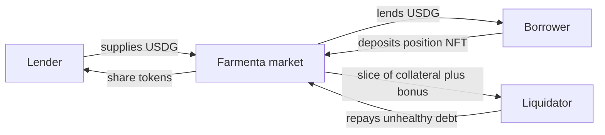
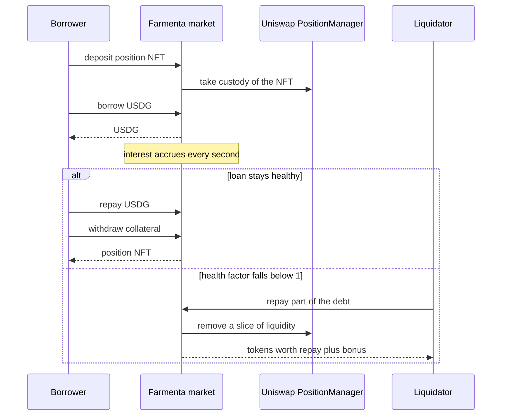

Farmenta connects two groups of people. **Lenders** have USDG and want to earn interest on it. **Borrowers** have a Uniswap v4 liquidity position and want USDG without closing that position. A market contract sits between them: it holds the lenders' USDG, holds the borrowers' positions as collateral, and keeps the record of who owes what.

## The short version

Lina supplies 100,000 USDG. Budi deposits a position worth $20,300 and borrows 12,000 USDG from the USDG that Lina supplied. Budi pays interest every second. Most of that interest goes to Lina. If the value of Budi's position falls too far, anyone can repay part of his loan and receive part of his position in return. When Budi repays in full, he gets his position back.

## The actors

### Lender

A lender deposits USDG into a market and receives **share tokens** in return: `fUSDG-BC` in the Blue-chip market and `fUSDG-MEME` in the Meme market. The number of share tokens does not change. Their value in USDG rises as borrowers pay interest.

A lender can withdraw at any time, as long as the market holds enough idle USDG. If most of the USDG is currently lent out, part of a withdrawal has to wait until borrowers repay. See [interest rates](../concepts/interest-rates.md).

### Borrower

A borrower brings a Uniswap v4 position. There are two ways to start:

- **You already have a position.** Deposit it with a single signature (`depositCollateralWithPermit`), or approve and then deposit (`depositCollateral`).
- **You do not have a position yet.** Create one and deposit it in the same transaction (`mintAndDeposit`).

Once the position is collateral, the borrower can:

1. **Borrow** USDG, up to the maximum loan to value of the pool.
2. **Manage the position** while the loan is open: claim the Uniswap fees, add liquidity, or remove part of the liquidity. Each of these is checked so that the loan stays safe afterwards. See [managing a position](../concepts/managing-collateral.md).
3. **Repay** at any time, in part or in full.
4. **Withdraw** the position once the debt is zero.

### Liquidator

A liquidator watches for loans whose [health factor](../concepts/health-factor.md) has fallen below 1. The liquidator repays part of the debt in USDG and receives a slice of the position's liquidity, worth the repaid amount plus a bonus. Anyone can be a liquidator. See [liquidations](../liquidations/overview.md).

### Keeper

A keeper is an automated program. The team plans to run keepers for two jobs: recording price observations for meme pools so that their time weighted average price stays fresh, and liquidating unhealthy loans, in direct competition with public liquidators. The profit of that liquidation keeper goes to the team treasury. Both jobs are open to the public, so anyone can run the same programs. See the [keeper disclosure](../risk/admin-powers.md#the-teams-liquidation-keeper).

### Owner

The owner is the admin of the protocol. It is a timelock contract: every owner call is scheduled on-chain first and runs two days later at the earliest. It lists pools, sets and tightens risk parameters, can pause a market, and can withdraw the part of the reserve that lies above the reserve floor. The owner can also upgrade the market contract, which takes about four days. These powers are significant and are described in full in [owner powers and upgradeability](../risk/admin-powers.md).

## The life of a loan

### 1. Deposit

The market checks that the position comes from a listed pool, that the pool is not frozen, that the pair is quoted in USDG, that the pool's hook is permitted, and that the position is worth at least the minimum. If any check fails, the deposit is rejected and the NFT never leaves your wallet. See [collateral](../concepts/collateral.md).

### 2. Borrow

The market values the position at the oracle price and lets you borrow up to the maximum loan to value: 65% in the Blue-chip market and 30% in the Meme market. A borrow is also rejected if the pool or market debt cap is full, or if a [price gate](../concepts/price-oracles.md) fails.

### 3. Interest

Interest accrues every second. The rate depends on **utilization**, the share of the market's USDG that is currently lent out. When little is borrowed the rate is low. When most of the USDG is borrowed the rate climbs steeply, which encourages repayment and new supply.

### 4. Repay or liquidate

If the loan stays healthy, you repay and take your position back. If the health factor falls below 1, the loan can be liquidated. In the Blue-chip market a liquidator can usually repay only half of the debt at a time, so you keep the rest of your position. See [liquidation mechanics](../liquidations/mechanics.md).

### 5. If the collateral is not enough

If a position falls in value so fast that it is worth less than the debt, the liquidator takes the whole position and the remaining debt becomes **bad debt**. The market's reserve absorbs it first. Anything left is shared by the lenders of that market through a lower share price. See [bad debt](../concepts/bad-debt.md).

## What the protocol charges

| Action | Protocol fee |
|---|---|
| Supplying or withdrawing USDG | None |
| Depositing or withdrawing a position | None |
| Borrowing or repaying | None |
| Claiming Uniswap fees, adding or removing liquidity | None |
| **Interest paid by borrowers** | **15% of the interest (Blue-chip) or 25% (Meme) goes to the reserve** |
| **Liquidation** | **The liquidator pays one tenth of the pool's liquidator bonus to the reserve: 0.5% of the repaid amount (Blue-chip) or 1% (Meme) at the preset bonus** |

Those two rows are the whole of Farmenta's fee model. See [protocol fees and reserves](../concepts/protocol-fees-and-reserves.md).

## Related pages

- [Markets](./markets.md)
- [Worked example](../worked-example/index.md)
- [Risk overview](../risk/overview.md)
