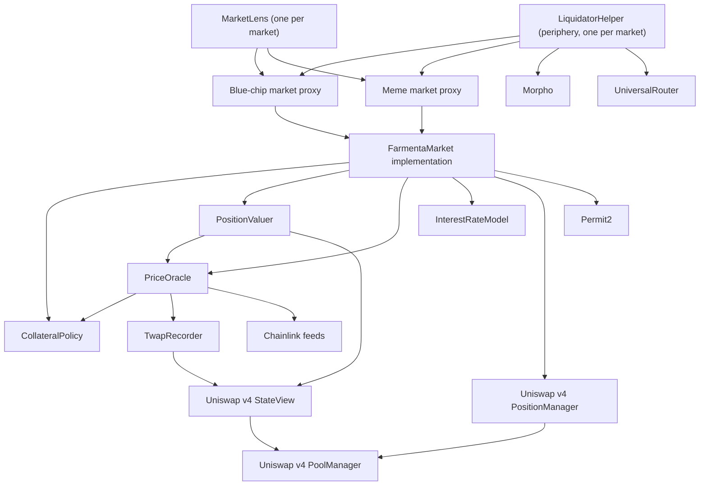

## Overview

Farmenta is a small set of contracts with one job each. The market holds the money, the collateral and the debt ledger. Around it sit helper contracts that answer one question each: which pools are allowed, what a position is worth, what a token costs, and what the borrow rate is.

Think of a market as a bank branch. The branch keeps the vault and the books, and it asks an appraiser, a price board, a rule book and a rate table before it acts. It cannot rewrite any of them on its own.

A small example of how the pieces meet: Budi deposits a Uniswap v4 position into the Blue-chip market and asks for 1,500 USDG. The market asks `CollateralPolicy` whether the pool is listed and on what terms, asks `PositionValuer` what the position is worth (say $10,000), and the valuer asks `PriceOracle` for the ETH and USDG prices. With a max LTV of 65% the limit is $6,500, so the borrow passes and the market records a debt of `1500000000` (1,500 USDG with 6 decimals).

All contracts are written in Solidity `0.8.26` (pinned, not a range) and released under the MIT licence. The source is in the [smart-contract repository](https://github.com/farmenta-defi/smart-contract).

## Component diagram



An arrow means "calls or reads". The two proxies share one implementation, so both markets run the same code with different storage.

## Contracts

| Contract | Purpose | Reference |
|---|---|---|
| `FarmentaMarket` | ERC-4626 vault for lenders, custody of position NFTs, debt ledger, liquidation. Deployed as two proxies: Blue-chip and Meme. | [FarmentaMarket](./farmenta-market.md) |
| `MarketLens` | Read-only risk and reserve views for one market. One lens per market. | [MarketLens](./market-lens.md) |
| `CollateralPolicy` | The list of accepted pools and the terms of each one. Owner managed. | [CollateralPolicy](./collateral-policy.md) |
| `PriceOracle` | USD prices: Chainlink for ETH and USDG, the TWAP recorder for meme tokens. | [PriceOracle](./price-oracle.md) |
| `TwapRecorder` | Permissionless recorder of pool ticks, the source of the meme TWAP. | [TwapRecorder](./twap-recorder.md) |
| `PositionValuer` | Values a position at oracle prices and reports its uncollected fees. Stateless, no owner. | [PositionValuer](./position-valuer.md) |
| `InterestRateModel` | One contract carrying the borrow rate curves of both tiers. | [InterestRateModel](./interest-rate-model.md) |
| `LiquidatorHelper` | Periphery contract, outside the core: flash loan, liquidation and swap in one transaction. | [LiquidatorHelper](./liquidator-helper.md) |

Every event and every custom error is listed on the [events](./events.md) and [errors](./errors.md) pages. The numbers behind the terms are on the [risk parameters](./risk-parameters.md) page.

Farmenta contract addresses are published on the [addresses page](./addresses.md) after deployment.

### External contracts

| External contract | Used by | For |
|---|---|---|
| Uniswap v4 PositionManager | `FarmentaMarket`, `PositionValuer`, `LiquidatorHelper` | The position NFT, minting, adding and removing liquidity, burning a position. |
| Uniswap v4 PoolManager | reached through PositionManager and StateView | Holds pool state and pays out tokens. Farmenta never calls it directly. |
| Uniswap v4 StateView | `PositionValuer`, `TwapRecorder`, `PriceOracle` | Reading pool price, tick, liquidity and fee growth. |
| Permit2 | `FarmentaMarket` | Pulling the borrower's tokens for `mintAndDeposit` and `increaseLiquidity`. The address is read from PositionManager. |
| Chainlink feeds | `PriceOracle` | ETH/USD and USDG/USD prices. |
| Morpho | `LiquidatorHelper` | USDG flash loans. |
| UniversalRouter | `LiquidatorHelper` | Swapping seized collateral to USDG. |

See the [Uniswap v4 documentation](https://docs.uniswap.org/contracts/v4/overview), the [Chainlink data feeds documentation](https://docs.chain.link/data-feeds) and the [Morpho documentation](https://docs.morpho.org) for the third party contracts.

## One proxy type, everything else is plain

Only `FarmentaMarket` sits behind a proxy. It uses the UUPS pattern: the upgrade logic lives in the implementation, and `_authorizeUpgrade` is restricted to the owner.

`CollateralPolicy`, `PositionValuer`, `PriceOracle`, `InterestRateModel` and `TwapRecorder` are plain, non-upgradeable contracts. The market stores the addresses of its dependencies as immutables of the implementation:

```solidity
IPositionManager public immutable positionManager;
ICollateralPolicy public immutable policy;
IPositionValuer public immutable valuer;
IPriceOracle public immutable oracle;
IInterestRateModel public immutable interestRateModel;
```

The same pattern continues one level down: `PriceOracle` keeps the policy and the `TwapRecorder` as immutables, and `PositionValuer` keeps PositionManager, StateView and the oracle.

There are no setters for these. Pointing a market at a new policy, valuer, oracle or rate model means deploying a new implementation and upgrading the proxy to it. The reason is simple: every extra proxy is one more place where storage can collide, and it would add no capability the upgrade does not already give.

The tier of a market (Blue-chip or Meme) is stored in proxy storage, not in an immutable, because one implementation serves both proxies. For the same reason `InterestRateModel` is one contract that carries both curves and takes the tier as an argument.

:::info[Upgrades]
Only the owner can authorize an upgrade of a market. Upgrades are not delayed today, and a timelock is planned before the protocol holds real funds. See [owner powers](../risk/admin-powers.md).
:::

## Storage layout

The market keeps its state under an ERC-7201 namespace, `farmenta.storage.Market`, declared once in the `MarketLedger` library:

```solidity
struct Loan {
    address owner;
    ICollateralPolicy.Tier tier;
    uint256 debtShares;
    PoolId poolKeyId;
}

struct Layout {
    ICollateralPolicy.Tier tier;
    mapping(uint256 tokenId => Loan) loans;
    mapping(PoolId poolId => uint256) poolDebtShares;
    uint256 totalBorrowShares;
    uint256 totalBorrows;
    uint256 borrowIndex;
    uint256 lastAccrual;
    uint256 reserves;
    uint16 reserveFactorBps;
    uint16 reserveFloorBps;
    uint256 totalReservesWithdrawn;
}
```

A namespaced layout starts at a slot derived from the namespace string instead of slot 0. Adding a variable in a later version cannot shift a slot that is already in use. The inherited OpenZeppelin upgradeable contracts namespace their own storage the same way.

## Libraries hold the logic, the market holds the wrappers

The market exposes thin functions and runs the work from libraries that are deployed on their own and linked to the implementation. Each call is a `delegatecall`, so the library code runs with the market's storage, the market's address and the original `msg.sender`.

| Library | Holds |
|---|---|
| `MarketDebt` | Interest accrual, `borrow`, `repay`, the borrow price gates, and the health checks that run after a borrower action. |
| `MarketMint` | Collateral admission, `mintAndDeposit`, `increaseLiquidity`. |
| `MarketLiquidity` | `collectFees`, `decreaseLiquidity`, and the recipient rule for payouts. |
| `MarketLiquidation` | The whole of `liquidate`: valuation, the seizure plan, ledger updates, payouts. |
| `MarketLedger` | The storage layout above. It declares where state lives, so the market and the four libraries all write the same slots. |

Pure arithmetic sits in internal libraries that are compiled into their callers: `DebtMath`, `LiquidationMath`, `PriceMath`, `PositionAmounts`, `TierPresets` and `HookPermissions`.

What stays in the market is what has to be visible from outside: the pause check, the reentrancy guard, the ERC-4626 surface and the owner functions.

:::info[Events and errors come from the market address]
Because the libraries run by `delegatecall`, every event they emit is logged by the market proxy, and every error they throw reverts the market call. To decode all of them, combine the ABI of `FarmentaMarket` with the ABIs of the four libraries. The liquidation errors, for example, are declared only in `MarketLiquidation`.
:::

## Units

Two units appear everywhere, and they must never be mixed.

| Quantity | Unit | Example |
|---|---|---|
| Debt, `totalBorrows`, `poolDebt`, reserves, debt caps, cash | USDG, 6 decimals | 1,500 USDG is `1500000000` |
| Position value, fee value, minimum position value, all valuer output | USD, scaled by 1e18 | $10,000 is `10000000000000000000000` |
| Prices | USD for one whole token, scaled by 1e18 | $2,500 is `2500000000000000000000` |
| Health factor | ratio, scaled by 1e18 | 1.25 is `1250000000000000000` |
| LTV, LT, bonus, haircut, reserve factor | basis points, 10,000 is 100% | 65% is `6500` |
| Borrow rate | per second, scaled by 1e18 | see [InterestRateModel](./interest-rate-model.md) |
| `borrowIndex` | scaled by 1e18, starts at `1e18` | |
| Share token (`fUSDG-BC`, `fUSDG-MEME`) | 9 decimals (USDG decimals plus the offset of 3) | |

Debt is compared with collateral only after it has been converted to USD at the oracle price of USDG:

```text
debtUsd = debt × price(USDG) / 10^decimals(USDG)
```

Token decimals are recorded when a token is configured in `CollateralPolicy` and are never read live from the token.

Debt caps are stored in USDG so that enforcing a cap never needs a price.

## The outbound call rule

Several market functions hand control to code the protocol does not own: a pool hook runs inside PositionManager, a native ETH transfer runs the recipient's code, and a payout goes to an address the caller picked.

The reentrancy guard covers the market's own functions and vault deposits. It deliberately does not cover the vault exits `withdraw` and `redeem`, because a lender should always be able to leave. That makes one rule binding on every function that calls out:

- All bookkeeping (debt, debt shares, per pool debt, reserves, bad debt) finishes before the first external call that can run third party code.
- The borrowed asset (USDG) leaves before any other asset. The one exception is a full seizure: the position is burned and PositionManager pays both tokens to the liquidator in pool order, after the ledger has been written.

The result is that code running in the middle of a market call always sees a ledger that is already settled. A lender who redeems from inside a callback is paid the same share price as one who redeems afterwards.

How each path applies it:

| Path | Order |
|---|---|
| `borrow` | Ledger written, then USDG sent. |
| `collectFees`, `decreaseLiquidity` | Only the interest accrual writes, and it comes first. Tokens flow from PoolManager to the recipient, USDG leg first. The health checks that follow only read. |
| `mintAndDeposit`, `increaseLiquidity` | The caller's tokens go from Permit2 straight to PositionManager and never sit in the market. Change is swept back to the caller, USDG first. |
| `liquidate`, liquidity slice | The slice arrives in the market, USDG is pulled from the liquidator, the ledger is written, then payouts leave, USDG first. |
| `liquidate`, full seizure | USDG is pulled and the ledger is written before the position is burned and paid out. |

## The vault and inflation attacks

Each market inherits OpenZeppelin's `ERC4626Upgradeable` and follows the [ERC-4626 standard](https://eips.ethereum.org/EIPS/eip-4626). Lender funds are:

```text
totalAssets = cash + totalBorrows − reserves
```

The vault uses a decimals offset of 3. Shares carry three more decimals than USDG, which adds virtual shares to the conversion. An attacker who tries to inflate the share price with a donation before the first deposit loses almost all of the donation to those virtual shares, so the classic first depositor attack does not pay.

## Ownership

| Contract | Owner |
|---|---|
| `FarmentaMarket` (each proxy) | `Ownable2StepUpgradeable`. The owner can pause, withdraw reserves above the floor, rescue unaccounted assets, and upgrade. |
| `CollateralPolicy` | `Ownable2Step`. The owner configures tokens, the hook allowlist, listings, freezes and LT ramps. |
| `PriceOracle`, `TwapRecorder`, `PositionValuer`, `InterestRateModel`, `MarketLens`, `LiquidatorHelper` | No owner and no privileged function. |

Ownership transfers are two step: the current owner nominates, and the new owner must accept.

## Related pages

- [FarmentaMarket](./farmenta-market.md)
- [Risk parameters](./risk-parameters.md)
- [Addresses](./addresses.md)
- [How it works](../overview/how-it-works.md)
- [Admin powers](../risk/admin-powers.md)
- [Pause and emergency](../risk/pause-and-emergency.md)
