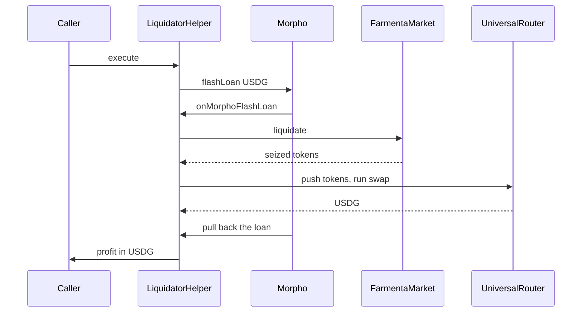

## What this contract is for

`LiquidatorHelper` lets you liquidate a position without holding any USDG. It borrows the USDG from Morpho for the length of one transaction, liquidates, sells the seized collateral for USDG, pays Morpho back and sends you what is left.

It is like buying a house at auction with a bridging loan that you repay the same afternoon by selling the house. If the sale does not cover the loan, the whole deal is undone and you have lost only the gas.

A small example: Rina sees a Blue-chip position with 1,000 USDG of debt and a health factor of 0.85, so it can be closed in full. She calls `execute` with a budget of 1,005 USDG. The helper borrows 1,010.025 USDG from Morpho (the budget plus the 0.5% protocol liquidation fee), liquidates, and receives ETH and USDG worth about $1,050. It swaps the ETH to USDG, repays Morpho, and sends Rina the remaining USDG as profit.

:::info[Periphery, not core]
The helper is a convenience contract outside the core protocol. The market does not know it exists. You can call `liquidate` on the market directly, or write your own helper. For the full workflow see the [liquidator guide](../liquidations/liquidator-guide.md).
:::

Helper addresses are on the [addresses page](./addresses.md).

## Contract summary

```solidity
constructor(ILiquidationMarket market_, IFlashLoanMorpho morpho_, address universalRouter_)
```

```solidity
ILiquidationMarket public immutable market;
IFlashLoanMorpho public immutable morpho;
IERC20 public immutable usdg;
IPositionManager public immutable positionManager;
address public immutable universalRouter;
```

| Item | Value |
|---|---|
| Bound to | One market. The Blue-chip market and the Meme market each need their own helper. |
| `usdg`, `positionManager` | Read from the market at deployment. |
| Owner | None. Anyone can call `execute`. |
| Upgradeable | No. |
| Holds funds | No. It must end every call with no collateral tokens and no ETH, and it pays out its whole USDG balance. |

## The flow



## `execute`

```solidity
function execute(uint256 tokenId, uint256 repayAmount, bytes calldata swapCalldata) external
```

| Argument | Meaning |
|---|---|
| `tokenId` | The position to liquidate. |
| `repayAmount` | The repayment budget in USDG (6 decimals). It is passed to `liquidate` as its `repayAmount`. |
| `swapCalldata` | The complete calldata for UniversalRouter, built off-chain. It carries its own minimum output. |

What it does:

1. Reverts with `ZeroRepayAmount()` if `repayAmount` is zero.
2. Reads the pool key of the position from PositionManager.
3. Works out the flash loan amount and calls `flashLoan` on Morpho.
4. After the callback has finished and Morpho has taken the loan back, sends the helper's whole USDG balance to the caller.

```text
protocolFeeBps = liquidatorBonusBps / 10          (rounded down)
flashAmount    = repayAmount × (10,000 + protocolFeeBps) / 10,000
```

The helper emits no events. The liquidation itself is reported by the market's `Liquidate` event, with the helper as `liquidator`.

### Choosing `repayAmount`

The budget is borrowed in full from Morpho, so the rules differ from a direct `liquidate` call.

- **Do not pass `type(uint256).max`.** The market accepts it, but the helper would ask Morpho for that amount and the call would fail.
- **Add a margin above the debt when the close factor is 100%.** Debt grows every second. A budget a little above the current debt makes sure the whole debt is closed. The part that is not used is simply returned to Morpho. Morpho charges no fee for a flash loan.
- **Do not pass exactly `debt × closeFactor` on a position with large uncollected fees.** When a position's fees are worth more than the seizure allows, the liquidator has to buy the borrower's non-USDG fee leg, and the money for that comes from the part of the budget above `debt × closeFactor`. With no margin, the market reverts with `FeePurchaseUnderfunded`. See [liquidation mechanics](../liquidations/mechanics.md).

The market never pulls more than the flash loan covers:

```text
pulled by the market = repay + protocolFee + cost
repay                = min(repayAmount, debt × closeFactor)
cost                 <= repayAmount − repay
```

Read `liquidationHealthFactor` and `liquidationCloseFactorBps` on [MarketLens](./market-lens.md) to size the budget, and simulate the call before you send it.

## The flash loan callback

```solidity
function onMorphoFlashLoan(uint256 assets, bytes calldata data) external
```

Morpho calls this function in the middle of `flashLoan`, after it has sent the USDG. Only Morpho can call it. Any other caller reverts with `UnauthorizedMorpho(caller)`.

Steps, in order:

1. Approve the market to pull `assets` USDG.
2. Call `market.liquidate(tokenId, repayAmount, 0, 0, address(this))`. The seized tokens arrive in the helper.
3. Reset the market's USDG allowance to zero.
4. Push the seized tokens to UniversalRouter and run `swapCalldata`.
5. Check that nothing is left behind (see [residual balance check](#residual-balance-check)).
6. Approve Morpho to pull `assets` USDG. Morpho takes the loan back when the callback returns.

The helper passes `0` for `minOut0` and `minOut1`. Price protection does not come from the liquidation call. It comes from two other places:

- the minimum output inside `swapCalldata`, and
- the flash loan itself: if the helper does not hold enough USDG at the end, Morpho's pull fails and the whole transaction reverts.

## The push-balance design

The exact amounts a liquidation seizes cannot be known off-chain down to the last wei. They depend on the debt at the moment of execution, the oracle price and the pool price, and all three can move between the quote and the transaction.

A route that names a fixed input amount would therefore often leave a few wei unsold, or ask for a few wei too many. The helper avoids the problem by not naming an amount at all.

| Token | How it reaches the router |
|---|---|
| Native ETH | Sent as the `value` of the call to UniversalRouter. The helper does not wrap it. |
| Any other ERC-20 of the pool | The helper's whole balance is transferred to UniversalRouter before the call. |
| USDG | Stays in the helper. It is never pushed. |

The helper gives UniversalRouter no Permit2 allowance and no ERC-20 allowance. The router can only use what was pushed to it.

```solidity
uint256 nativeValue = _pushCurrency(key.currency0) + _pushCurrency(key.currency1);

(bool ok, bytes memory reason) = universalRouter.call{value: nativeValue}(swapCalldata);
if (!ok) revert SwapFailed(reason);
```

## What `swapCalldata` must contain

`swapCalldata` is the full call to UniversalRouter, function selector included. You build it off-chain from a quote. The helper forwards it as it is.

The route has to follow the push-balance design:

| Requirement | How |
|---|---|
| Pay the swap from the router's own balance, in full | Settle the input with `CONTRACT_BALANCE` and the payer flag set to `false`. |
| Swap whatever amount arrived | Use an exact input swap with `OPEN_DELTA` as the amount. |
| Protect the price | Take the USDG output with a minimum amount. This is the only price protection in the whole transaction. |
| Deliver the USDG to the helper | The output must end up in the helper, because that is where Morpho pulls from. |
| Leave nothing in the router | Consume the whole input balance, or sweep what remains back. |
| Handle ETH | The helper sends native ETH. If the route needs WETH, wrap inside the route. |
| Cover every token the helper receives | The swap must sell the whole non-USDG side, including a fee leg the liquidator bought. |

Two practical notes:

- A position can be a large part of its own pool's liquidity. After a full seizure that liquidity is gone, so route the swap through a pool that still has depth.
- Quote close to execution, and leave room in the minimum output for the price to move.

:::warning[Anything left in the router can be taken by anyone]
Tokens that the route does not consume stay in UniversalRouter, where any account can sweep them. The helper cannot get them back. Make sure your route uses or sweeps its whole input.
:::

## Residual balance check

After the swap the helper checks that it holds nothing but USDG.

| Checked | Error when not zero |
|---|---|
| Balance of `currency0` (WETH when `currency0` is native ETH) | `ResidualBalance(token, balance)` |
| Balance of `currency1` | `ResidualBalance(token, balance)` |
| Native ETH balance | `ResidualBalance(address(0), balance)` |

USDG is skipped, because USDG is what the helper is meant to hold at this point.

The check is a safety net. It catches a route that sends collateral back to the helper instead of selling it. It does not see tokens left in the router.

## Profit

After Morpho has taken the loan back, `execute` sends the helper's whole USDG balance to the caller.

```text
profit = USDG side of the seizure + swap output − (repay + protocolFee + cost)
```

The flash loan itself cancels out: what the market did not pull goes back to Morpho together with the rest.

There is no minimum profit check. A liquidation that ends with exactly enough USDG to repay Morpho succeeds with zero profit. Simulate first, and treat gas as part of the cost.

The protocol liquidation fee is paid from the flash loan, so it is already inside this figure.

## Errors

| Error | Thrown when | What to do |
|---|---|---|
| `ZeroRepayAmount()` | `execute` is called with `repayAmount` of zero. | Pass a budget above zero. |
| `UnauthorizedMorpho(address caller)` | `onMorphoFlashLoan` is called by anyone but Morpho. | Call `execute`. The callback is not an entry point. |
| `SwapFailed(bytes reason)` | The call to UniversalRouter reverted. `reason` is the router's revert data. | Decode `reason`. Usual causes are a minimum output that was not met, a stale quote, or a route through a pool without liquidity. |
| `ResidualBalance(address token, uint256 balance)` | The helper still holds a collateral token or ETH after the swap. `token` is `address(0)` for ETH. | Make the route sell the whole input and send only USDG to the helper. |

Errors from the market pass through unchanged, for example `PositionIsHealthy`, `FeePurchaseUnderfunded` and `EnforcedPause`. If the helper ends up with less USDG than the loan, the transaction reverts inside Morpho's transfer.

All errors are listed on the [errors page](./errors.md).

## Related pages

- [Liquidator guide](../liquidations/liquidator-guide.md)
- [Liquidation mechanics](../liquidations/mechanics.md)
- [Liquidations overview](../liquidations/overview.md)
- [MarketLens](./market-lens.md)
- [FarmentaMarket](./farmenta-market.md)
- [Morpho documentation](https://docs.morpho.org)
