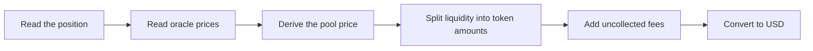

## What this contract is for

`PositionValuer` answers one question: what does this Uniswap v4 position hold, and what is that worth in USD? The market asks it every time it has to size a loan, check a health factor or plan a liquidation.

It works like an appraiser who writes a report and leaves the decision to someone else. The valuer lists the parts: tokens held, fees earned, their USD value and how far the pool price is from the oracle price. It applies no risk rule. The market decides what to do with the report.

A small example: with ETH at $2,500 and USDG at $1.00, a position holds 1.2 ETH and 2,000 USDG and has earned 0.01 ETH and 30 USDG in fees.

```text
principalUsd = 1.2 × 2,500 + 2,000 × 1.00 = 5,000
feesUsd      = 0.01 × 2,500 + 30 × 1.00   = 55
```

The valuer is stateless, has no owner and no settings. Its address is published on the [addresses page](./addresses.md) after deployment.

## Contract summary

```solidity
contract PositionValuer is IPositionValuer
```

```solidity
constructor(IPositionManager positionManager_, IStateView stateView_, IPriceOracle oracle_)
```

```solidity
IPositionManager public immutable positionManager;
IStateView public immutable stateView;
IPriceOracle public immutable oracle;
```

| Item | Value |
|---|---|
| State | None. Every call reads Uniswap and the oracle again. |
| Owner | None. |
| Upgradeable | No. The market stores the valuer address as an immutable and changes it only through a market upgrade. |
| Caller | Anyone. All three functions are views. |

## The `Valuation` struct

```solidity
struct Valuation {
    uint128 liquidity;
    uint256 amount0;
    uint256 amount1;
    uint256 fees0;
    uint256 fees1;
    uint256 principalUsd;
    uint256 feesUsd;
    uint256 spotDeviationBps;
}
```

| Field | Unit | Meaning |
|---|---|---|
| `liquidity` | Uniswap liquidity units | The liquidity of the position. Zero means the position is empty. |
| `amount0` | raw units of `currency0` | The `currency0` the position holds at the oracle derived price. |
| `amount1` | raw units of `currency1` | The `currency1` the position holds at the oracle derived price. |
| `fees0` | raw units of `currency0` | Fees earned and not yet collected, in `currency0`. |
| `fees1` | raw units of `currency1` | Fees earned and not yet collected, in `currency1`. |
| `principalUsd` | USD, scaled by 1e18 | The value of `amount0` plus `amount1`. |
| `feesUsd` | USD, scaled by 1e18 | The value of `fees0` plus `fees1`. Reported in full, without any cap. |
| `spotDeviationBps` | basis points | How far the pool's spot price is from the oracle derived price. |

"Raw units" means the token's smallest unit: 1 USDG is `1000000`, 1 ETH is `1000000000000000000`.

## Functions

### `value`

```solidity
function value(uint256 tokenId) external view returns (Valuation memory)
```

Values a position at borrowing prices, using `PriceOracle.price`. The market uses it for admission, `borrow`, and the checks after `collectFees`, `increaseLiquidity` and `decreaseLiquidity`. [MarketLens](./market-lens.md) uses it for `positionValue`, `maxBorrow` and `healthFactor`.

### `valueForLiquidation`

```solidity
function valueForLiquidation(uint256 tokenId) external view returns (Valuation memory)
```

The same arithmetic at liquidation prices, using `PriceOracle.priceForLiquidation`. `liquidate` and `MarketLens.liquidationHealthFactor` use it.

The only difference from `value` is the price source. Both currencies are always read from the same surface, so a valuation never has one leg at a borrowing price and the other at a liquidation price.

On the Blue-chip market the two functions return the same numbers. On the Meme market they can differ, and `valueForLiquidation` keeps working when the TWAP is unavailable. See [PriceOracle](./price-oracle.md).

### `feesOf`

```solidity
function feesOf(uint256 tokenId) external view returns (uint256 fees0, uint256 fees1)
```

The uncollected fees of a position in raw token units. They are the same `fees0` and `fees1` that `value` reports, read without any price, so `feesOf` answers even when the oracle does not.

The market calls `feesOf` just before it claims fees, and reports the result in the `CollectFees` event.

These amounts are what the next liquidity action on the position pays out, with one exception: a pool hook that swaps or donates from inside that same action can move the pool's fee growth first.

## How a position is valued



1. **Read the position.** Pool key and tick range come from PositionManager. Liquidity and fee growth come from StateView.
2. **Read the prices.** The USD price and the recorded decimals of both tokens come from the oracle.
3. **Derive the pool price.** The valuer computes the price the pool would have if it agreed with the oracle.
4. **Split the liquidity.** Token amounts are computed at the derived price, not at the pool's spot price.
5. **Add the fees.** Uniswap v4 stores no "tokens owed" figure. Fees exist only as the difference between the pool's fee growth inside the range and the value cached on the position.
6. **Convert to USD.** Each amount is multiplied by its price and divided by the token's decimals.

```text
ratio            = (price0 / 10^decimals0) / (price1 / 10^decimals1)
derivedSqrtPrice = sqrt(ratio) × 2^96

fees0 = (feeGrowthInside0 − feeGrowthInside0Last) × liquidity / 2^128
fees1 = (feeGrowthInside1 − feeGrowthInside1Last) × liquidity / 2^128

principalUsd = amount0 × price0 / 10^decimals0 + amount1 × price1 / 10^decimals1
feesUsd      = fees0   × price0 / 10^decimals0 + fees1   × price1 / 10^decimals1
```

### Why the oracle price and not the pool price

The mix of tokens in a position depends on the price. If the valuer used the pool's spot price, someone could push the pool to one edge of a position's range for a moment and change what the position appears to hold. Using a price derived from oracles makes the valuation independent of the pool's current state.

The three cases for the derived price:

| Derived price | Position holds |
|---|---|
| At or below the lower bound of the range | Only `currency0` |
| Inside the range | A mix of both |
| At or above the upper bound of the range | Only `currency1` |

A position that has moved out of range is not liquidated for that reason. It is valued as the single token it now holds, and its health factor follows the price of that token.

### Rounding

Amounts are always rounded down. A position is never valued above what it can return, because that value backs a loan.

Positions with only a few wei on one side cannot be valued with precision. That is one reason pools have a minimum position value.

### Spot deviation

```text
spotDeviationBps = |spotPrice − derivedPrice| × 10,000 / derivedPrice
```

The pool's spot price is read for this one purpose: to measure how far it has drifted from the oracle. It is compared as a price, not as a square root price, so 200 basis points means a 2% difference in price.

## What the valuer does not do

The valuer reports the parts and applies no risk parameter. The market applies them, using the terms from `CollateralPolicy`.

| Rule | Applied by | Where |
|---|---|---|
| Fees count only up to 10% of principal | Market | Collateral value, for borrowing and the health factor |
| Removal haircut | Market | Collateral value, minimum position value, liquidation value |
| Spot within 2% of the oracle (Blue-chip) | Market | `borrow`, and `collectFees`, `increaseLiquidity`, `decreaseLiquidity` on a position with debt |
| Minimum position value | Market | Admission and `decreaseLiquidity` |
| Max LTV and liquidation threshold | Market | `borrow` and the health factor |

```text
collateralValue = (principalUsd + min(feesUsd, principalUsd / 10)) × (1 − removalHaircut)
realizableValue = (principalUsd + feesUsd) × (1 − removalHaircut)
```

Borrowing and the health factor use `collateralValue`. A liquidation measures the seizure against `realizableValue`, because the liquidator receives real tokens, including all the fees.

Keeping risk rules out of the valuer means a risk parameter can change without a new valuer.

## Errors

| Error | Thrown by | Meaning |
|---|---|---|
| `PositionNotFound(uint256 tokenId)` | `PositionValuer` | The position does not exist or was burned. |
| `ZeroPrice()` | `PriceMath` | A price used to derive the pool price is zero. |
| `PriceOutOfRange()` | `PriceMath` | The price derived from the oracle is outside the range Uniswap can represent. |

Errors of the oracle pass through the valuer unchanged: `StalePrice`, `InvalidPrice`, `PriceFeedNotConfigured`, `MemeTwapUnavailable`, `MemeSpotUnavailable` and `MemeCurrencyNotInPool`. See the [errors page](./errors.md).

The valuer emits no events.

## Related pages

- [Position valuation](../concepts/position-valuation.md)
- [PriceOracle](./price-oracle.md)
- [MarketLens](./market-lens.md)
- [Health factor](../concepts/health-factor.md)
- [Collateral](../concepts/collateral.md)
