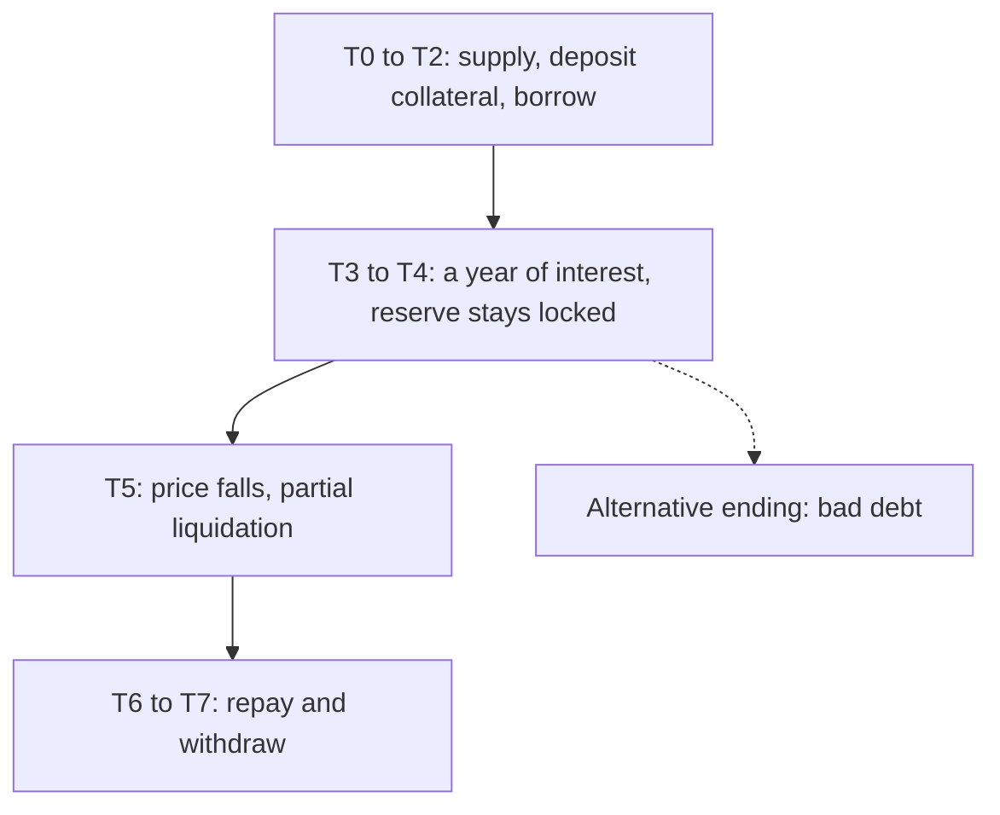

## What this example shows

This section follows a single loan through its whole life, with numbers at every step. The goal is to show exactly **when the protocol charges a fee, who pays it, and how much**.

Think of it as following one banknote through a bank: it goes in with a saver, out to a borrower, grows with interest, and comes back. At each stop you see who holds what, and whether the protocol took a cut.

The short answer is that the protocol charges a fee in only two places: a share of the interest, and a small fee on liquidations. Everything else is free. The pages below prove it step by step.

## The cast

| Person | Role | What they want |
|---|---|---|
| **Lina** | Lender | Supplies USDG and earns interest |
| **Budi** | Borrower | Owns an ETH/USDG liquidity position NFT and wants USDG without closing the position |
| **Rina** | Liquidator | Closes unhealthy loans and earns the liquidator bonus |

## The market

The example takes place in the **Blue-chip market**, which accepts ETH/USDG and WETH/USDG positions. These are its parameters.

| Parameter | Value | What it means |
|---|---|---|
| Max LTV | 65% | The most you can borrow against the collateral value. Checked when you borrow. |
| Liquidation threshold (LT) | 75% | When debt passes this share of the collateral value, the loan can be liquidated. |
| Liquidator bonus | 5% | The liquidator's reward, on top of the amount they repay. |
| Protocol liquidation fee | 0.5% of the amount repaid | Always one tenth of the bonus. It is derived from the bonus, not stored on its own. |
| Close factor | 50%; 100% if `HF < 0.9` or debt `< 100 USDG` | The share of the debt one liquidation may repay. |
| Reserve factor | 15% | The share of interest the protocol takes. |
| Reserve floor | 1% of lender funds | The part of the reserve the owner cannot withdraw. |
| Borrow rate | Rises with utilization | 4% a year when 80% of the funds are in use, much steeper above that. |

The borrow rate follows a curve with a kink at 80% utilization:

```text
utilization = total debt / (cash + total debt)

up to 80%:   rate = 4% × utilization / 80%
above 80%:   rate = 4% + 60% × (utilization - 80%) / 20%
```

See [interest rates](../concepts/interest-rates.md) for the full model and [risk parameters](../reference/risk-parameters.md) for both markets.

## Ten terms used in this example

All of these are defined in more detail in the [glossary](../resources/glossary.md).

| Term | Short definition |
|---|---|
| **Collateral** | The borrower's Uniswap v4 liquidity position NFT, handed to Farmenta. While it is collateral, the market contract owns the NFT. It is not merely locked. |
| **Market funds** | The USDG supplied by lenders, held in the market contract. Borrowers draw their loans from it. |
| **Share token** | The receipt a lender gets for a deposit (`fUSDG-BC` in this market). The number of tokens stays the same. Their exchange rate against USDG rises, and that is how interest reaches the lender. |
| **Position value** | What the NFT holds in dollars at oracle prices: the value of its liquidity (the principal) plus Uniswap fees that have not been claimed. The lens function `positionValue` returns the collateral value, not this figure. |
| **LTV** | Debt divided by collateral value. Max LTV is the limit at the moment of borrowing. |
| **LT** | The same ratio, used to decide when a loan can be liquidated. The gap between max LTV (65%) and LT (75%) is the borrower's safety room. |
| **Health factor (HF)** | The health of a loan in one number: `HF = collateral value × LT / debt`. Collateral value is the position value with unclaimed fees counted only up to 10% of principal, after any removal haircut. In this example the two are equal. Below 1, the loan can be liquidated. |
| **Close factor** | The share of a debt that one liquidation may repay. |
| **Reserve** | The protocol's buffer, filled by the two protocol fees. If a loan goes bad, the reserve takes the loss before lenders do. |
| **Lender funds** | Everything lenders have a claim on (`totalAssets`): idle cash plus money out on loan, minus the reserve. Repaying a loan does not change this figure. It only moves money from "on loan" to "idle". |

## Simplifications

The example trades a little precision for numbers you can check by hand.

- **Simple yearly interest.** Interest is calculated once for the whole year. The contract accrues interest by the second and adds it to the debt every time the market is touched, so real figures come out slightly higher.
- **Constant utilization.** Utilization is held at 50% for the year. In practice it changes whenever someone supplies, withdraws, borrows or repays.
- **1 USDG is treated as $1.** The contract converts debt to dollars at the Chainlink USDG price before comparing it with the collateral value.
- **Rounded and illustrative.** All amounts are rounded to cents. They illustrate the rules and are not test vectors.

## Timeline



| Step | What happens | Protocol fee | Page |
|---|---|---|---|
| T0 | Lina supplies $100,000 USDG | None | [Step 1](./supply-and-borrow.md) |
| T1 | Budi deposits his position NFT, worth $20,300 | None | [Step 1](./supply-and-borrow.md) |
| T2 | Budi borrows $12,000 | None | [Step 1](./supply-and-borrow.md) |
| T3 | A year passes, $1,250 of interest accrues | **$187.50** (15% of interest) | [Step 2](./interest-and-reserves.md) |
| T4 | The owner tries to withdraw reserves and is refused | None | [Step 2](./interest-and-reserves.md) |
| T5 | ETH falls, Rina liquidates half of Budi's debt | **$30.75** (0.5% of the amount repaid) | [Step 3](./liquidation.md) |
| T6 | Budi repays the rest and takes his NFT back | None | [Step 4](./repay-and-withdraw.md) |
| T7 | Lina withdraws | None | [Step 4](./repay-and-withdraw.md) |

Two more pages explore what changes under different conditions:

- [Alternative ending: bad debt](./bad-debt-scenario.md) replaces T5 with a much deeper price fall.
- [Variations: the Meme market and frozen pools](./meme-market-and-frozen-pools.md) shows the stricter market and what happens when the owner tightens a pool.

## Related pages

- [How it works](../overview/how-it-works.md)
- [Protocol fees and reserves](../concepts/protocol-fees-and-reserves.md)
- [Health factor](../concepts/health-factor.md)
- [Glossary](../resources/glossary.md)

Start with [Step 1: Supplying, depositing collateral, borrowing](./supply-and-borrow.md).
