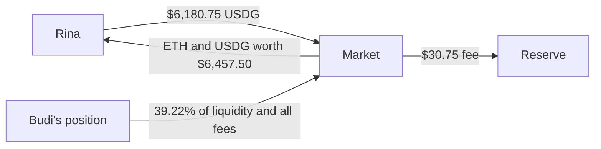

## What happens

The price of ETH drops sharply and Budi's collateral is no longer worth enough to back his debt safely. Rina steps in, repays half of the debt for him, and receives a slice of his position worth 5% more than she paid.

**This is the second protocol fee.** Rina pays an extra 0.5% of the amount she repays, and it goes to the reserve.

## T5: the position is valued again

The `PositionValuer` reads Budi's position at the new oracle price:

```text
principal                               $15,700.00
unclaimed fees                             $300.00   (Budi claimed his fees regularly during the year)
                                        ----------
position value                          $16,000.00
```

A liquidity position does not fall one for one with ETH. Part of it is USDG, and the mix shifts as the price moves through its range. The value comes from the [position valuation](../concepts/position-valuation.md) formulas, not from multiplying by a percentage.

The $300 of fees is under the cap of 10% of principal ($1,570), so all of it counts.

```text
HF = $16,000 × 75% / $12,300            = 0.976
```

The [health factor](../concepts/health-factor.md) is below 1, so the loan can be liquidated by anyone.

### How much can be repaid

```text
HF 0.976 is not below 0.9, and the debt is not below 100 USDG
close factor                            = 50%
most that can be repaid = $12,300 × 50% = $6,150.00
```

Because the health factor is still above 0.9, Rina may repay only half of the debt. This leaves Budi a position he can still rescue.

## The call

```solidity
// liquidate(tokenId, repayAmount, minOut0, minOut1, to)
market.liquidate(tokenId, 6_150e6, minOut0, minOut1, rina);
```

`minOut0` and `minOut1` are the least ETH and USDG Rina is willing to receive. They are measured on what she actually receives. If the result is lower, the whole transaction reverts.

Rina must have approved the market to pull USDG from her.

Passing exactly the close factor amount works here because the position's $300 of fees is smaller than the seizure. On a position whose fees exceed the seizure this call reverts with `FeePurchaseUnderfunded`, so bots should pass a larger budget. See the [liquidator guide](../liquidations/liquidator-guide.md#choose-repayamount).

## The money that moves

```text
debt repaid by Rina      = $12,300 × 50%            = $6,150.00
value seized for Rina    = $6,150 × (1 + 5%)        = $6,457.50
protocol fee rate        = bonus / 10 = 5% / 10     =      0.5%

Rina pays                = $6,150 × 1.005           = $6,180.75
    repays Budi's debt                                $6,150.00
    goes to the reserve                                  $30.75   PROTOCOL FEE

Rina receives (ETH + USDG)                          = $6,457.50
Rina's net profit        = $6,457.50 - $6,180.75    =   $276.75
```

Rina's profit is 4.5% of what she repaid, which is **90% of the 5% bonus**. That is not a coincidence. The protocol fee is always one tenth of the bonus, so the liquidator always keeps nine tenths, in every market and every pool.

If a pool is listed with a stricter bonus, for example 7%, the protocol fee becomes 0.7% and the liquidator's net profit 6.3%, without the owner changing any other setting.

For Budi, the liquidation is costly. He gave up $6,457.50 of collateral to clear $6,150.00 of debt, a loss of $307.50.

## How Rina actually receives ETH and USDG

A position NFT cannot be cut into pieces. What Rina receives is a **liquidity slice**: part of the position's liquidity is removed and paid out as the two tokens.

Unclaimed fees are used first, and the rest comes from the principal:

```text
fee credit      = min(fees, value seized)
                = min($300.00, $6,457.50)                   = $300.00

liquidity slice = (value seized - fee credit) / principal
                = ($6,457.50 - $300.00) / $15,700.00
                = $6,157.50 / $15,700.00                    = 39.22%
```

Removing liquidity from a Uniswap position always pays out **all** of its unclaimed fees, not part of them. For that reason the proceeds go to the market contract first, and the market forwards to Rina only what she is entitled to:

```text
market receives : $6,157.50 (principal slice) + $300.00 (all fees) = $6,457.50
Rina receives   : $6,157.50 + $300.00                              = $6,457.50
fees left over  : $300.00 - $300.00                                =     $0.00
```



### When fees exceed the seizure

In this example nothing is left over. If a position holds more fees than the liquidator is entitled to, the extra fees do not go to the liquidator for free:

- The USDG part repays more of the borrower's debt.
- While debt remains, the liquidator must buy the other token at the oracle price, with no bonus and no protocol fee. That USDG also repays debt.
- Only what the debt cannot absorb is returned to the borrower.

See [liquidation mechanics](../liquidations/mechanics.md) for the full rules.

## State after the liquidation

```text
Budi's debt        = $12,300.00 - $6,150.00          = $6,150.00
Budi's position    = $15,700.00 - $6,157.50          = $9,542.50   (no unclaimed fees left)
HF                 = $9,542.50 × 75% / $6,150.00     =     1.164   healthy again
reserve            = $187.50 + $30.75                =   $218.25
```

```text
Market state after T5

cash                  $56,180.75   ($50,000.00 + $6,180.75 from Rina)
total debt            $45,100.00   ($51,250.00 - $6,150.00)
reserve                  $218.25
lender funds         $101,062.50
```

Lender funds are unchanged. The liquidation fee went to the reserve, not to Lina, and Budi's repaid debt simply turned into cash.

## Liquidating without capital

Rina usually does not use her own money. The `LiquidatorHelper` contract wraps the whole operation in one transaction with a flash loan from Morpho.

```solidity
// execute(tokenId, repayAmount, swapCalldata)
helper.execute(tokenId, 6_150e6, swapCalldata);
```

1. The helper borrows $6,180.75 USDG from Morpho: the repay budget plus the protocol fee.
2. It calls `liquidate` on the market and receives the ETH and USDG.
3. It swaps the ETH side to USDG through Uniswap's Universal Router, using `swapCalldata` that Rina prepared off-chain with her own minimum output.
4. It repays the flash loan.
5. It sends the remaining USDG to Rina as profit.

Two things to know. The `repayAmount` you pass to the helper is a budget that is borrowed in full, so it has to be a real number, not the maximum integer. And the $276.75 is the profit at oracle prices: the swap price and gas reduce what Rina keeps.

See the [liquidator guide](../liquidations/liquidator-guide.md) and the [LiquidatorHelper reference](../reference/liquidator-helper.md).

## Summary of step 3

| Item | Amount |
|---|---|
| Health factor before | 0.976 |
| Debt repaid | $6,150.00 |
| Rina pays | $6,180.75 |
| Rina receives | $6,457.50 |
| Rina's net profit | $276.75 (4.5% of the amount repaid) |
| **Protocol fee** | **$30.75**, paid by Rina, to the reserve |
| Health factor after | 1.164 |

## Related pages

- [Liquidations overview](../liquidations/overview.md)
- [Liquidation mechanics](../liquidations/mechanics.md)
- [Liquidator guide](../liquidations/liquidator-guide.md)
- [Health factor](../concepts/health-factor.md)

Next: [Step 4: Repaying and withdrawing](./repay-and-withdraw.md). To see what happens when the price falls much further, read [Alternative ending: bad debt](./bad-debt-scenario.md).
